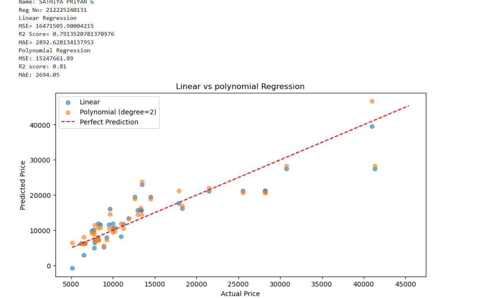
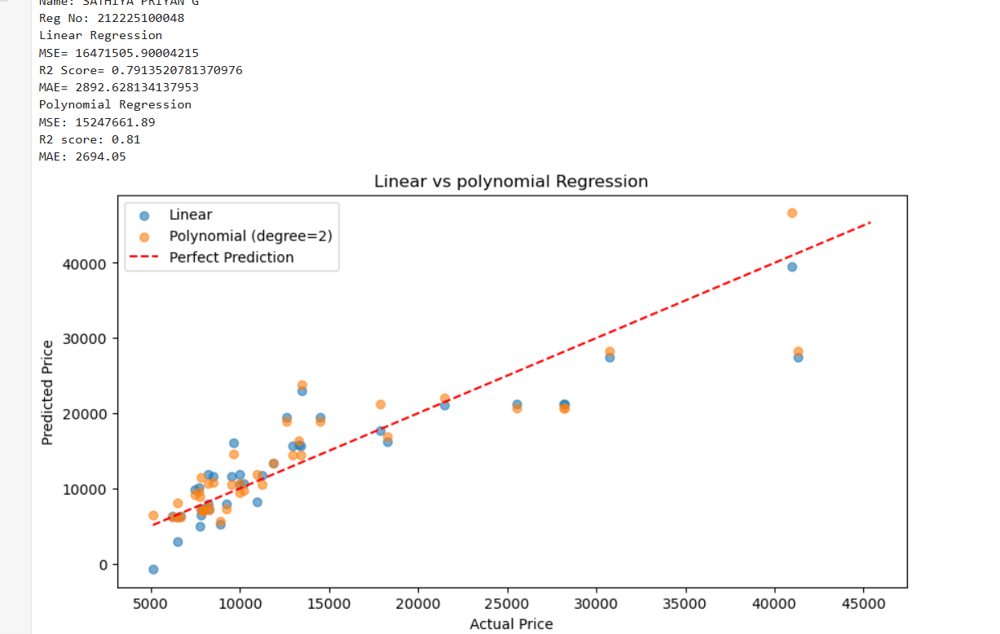

# BLENDED_LEARNING
# Implementation-of-Linear-and-Polynomial-Regression-Models-for-Predicting-Car-Prices

## AIM:
To write a program to predict car prices using Linear Regression and Polynomial Regression models.

## Equipments Required:
1. Hardware – PCs
2. Anaconda – Python 3.7 Installation / Jupyter notebook

## Algorithm
1. 
2. 
3. 
4. 

## Program:
```
/*
Program to implement Linear and Polynomial Regression models for predicting car prices.
Developed by: SATHIYA PRIYAN G
RegisterNumber:  212225100048
*/
```
```
import pandas as pd
from sklearn.model_selection import train_test_split
from sklearn.linear_model import LinearRegression
from sklearn.preprocessing import PolynomialFeatures, StandardScaler
from sklearn.pipeline import Pipeline
from sklearn.metrics import mean_squared_error , r2_score
from sklearn.metrics import mean_absolute_error
import matplotlib.pyplot as plt

# Load data
df = pd.read_csv('CarPrice_Assignment.csv')
from sklearn.model_selection import train_test_split
from sklearn.linear_model import LinearRegression
from sklearn.preprocessing import PolynomialFeatures, StandardScaler
from sklearn.pipeline import Pipeline
from sklearn.metrics import mean_squared_error , r2_score
from sklearn.metrics import mean_absolute_error
import matplotlib.pyplot as plt

# Load data
df = pd.read_csv('CarPrice_Assignment.csv')
df.head()
# Select features & target
x=df[['enginesize','horsepower','citympg','highwaympg']]
y=df['price']

x_train, x_test, y_train, y_test = train_test_split(x, y, test_size=0.2, random_state=42)


# 1. Linear Regression (with scaling)
lr= Pipeline([
    ('scaler', StandardScaler()),
    ('model', LinearRegression())
])
lr.fit(x_train, y_train)
y_pred_linear = lr.predict(x_test)

# 2. Polynomial Regression (degree=2)
poly_model = Pipeline([
    ('poly', PolynomialFeatures(degree=2)),
    ('scaler', StandardScaler()),
    ('model', LinearRegression())
])
poly_model.fit(x_train, y_train)
y_pred_poly = poly_model.predict(x_test)

# Evaluate models
print('Name: SATHIYA PRIYAN G')
print('Reg No: 212225240131')
print("Linear Regression")
# mse=mean_squared_error(y_test,y_pred_linear)
print('MSE=',mean_squared_error(y_test,y_pred_linear))
r2score=r2_score(y_test,y_pred_linear)
print('R2 Score=',r2score)
# mae=mean_absolute_error(y_test,y_pred_linear)
print('MAE=',mean_absolute_error(y_test,y_pred_linear))
print("Polynomial Regression")
print(f"MSE: {mean_squared_error(y_test, y_pred_poly):.2f}")
print(f"R2 score: {r2_score(y_test, y_pred_poly):.2f}")
print(f"MAE: {mean_absolute_error(y_test, y_pred_poly):.2f}")

# Plot actual vs predicted
plt.figure(figsize=(10,5))
plt.scatter(y_test, y_pred_linear, label='Linear', alpha=0.6)
plt.scatter(y_test,y_pred_poly, label='Polynomial (degree=2)',alpha=0.6)
plt.plot([y.min(),y.max()], [y.min(),y.max()], 'r--',label='Perfect Prediction')
plt.xlabel("Actual Price")
plt.ylabel("Predicted Price")
plt.title("Linear vs polynomial Regression")
plt.legend()
plt.show()
df.head()
# Select features & target
x=df[['enginesize','horsepower','citympg','highwaympg']]
y=df['price']

x_train, x_test, y_train, y_test = train_test_split(x, y, test_size=0.2, random_state=42)


# 1. Linear Regression (with scaling)
lr= Pipeline([
    ('scaler', StandardScaler()),
    ('model', LinearRegression())
])
lr.fit(x_train, y_train)
y_pred_linear = lr.predict(x_test)

# 2. Polynomial Regression (degree=2)
poly_model = Pipeline([
    ('poly', PolynomialFeatures(degree=2)),
    ('scaler', StandardScaler()),
    ('model', LinearRegression())
])
poly_model.fit(x_train, y_train)
y_pred_poly = poly_model.predict(x_test)

# Evaluate models
print('Name: SATHIYA PRIYAN G')
print('Reg No: 212225100048')
print("Linear Regression")
# mse=mean_squared_error(y_test,y_pred_linear)
print('MSE=',mean_squared_error(y_test,y_pred_linear))
r2score=r2_score(y_test,y_pred_linear)
print('R2 Score=',r2score)
# mae=mean_absolute_error(y_test,y_pred_linear)
print('MAE=',mean_absolute_error(y_test,y_pred_linear))
print("Polynomial Regression")
print(f"MSE: {mean_squared_error(y_test, y_pred_poly):.2f}")
print(f"R2 score: {r2_score(y_test, y_pred_poly):.2f}")
print(f"MAE: {mean_absolute_error(y_test, y_pred_poly):.2f}")

# Plot actual vs predicted
plt.figure(figsize=(10,5))
plt.scatter(y_test, y_pred_linear, label='Linear', alpha=0.6)
plt.scatter(y_test,y_pred_poly, label='Polynomial (degree=2)',alpha=0.6)
plt.plot([y.min(),y.max()], [y.min(),y.max()], 'r--',label='Perfect Prediction')
plt.xlabel("Actual Price")
plt.ylabel("Predicted Price")
plt.title("Linear vs polynomial Regression")
plt.legend()
plt.show()
```


## Output:



## Result:
Thus, the program to implement Linear and Polynomial Regression models for predicting car prices was written and verified using Python programming.
